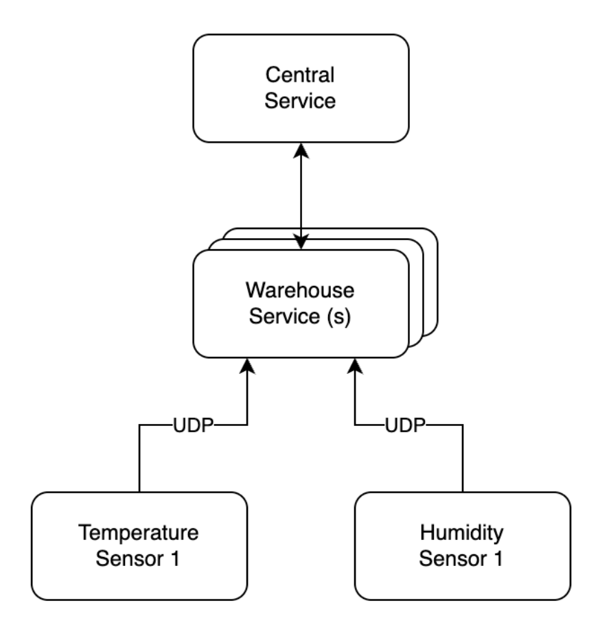

# Warehouse Monitoring Service

## Overview

There is a warehouse equipped with various types of sensors that monitor environmental conditions. These sensors provide measurements such as current temperature and
humidity, which are transmitted via UDP. The warehouse service interacts with all these sensors and automatically publishes the measurements to a central monitoring service. This
service oversees multiple warehouses and activates an alarm if temperature or humidity readings exceed configured thresholds.



## System design

- **Warehouse Service**: Collects data from various sensors and sends it to the Central Monitoring Service.
- **Central Monitoring Service**: Configured with thresholds for temperature and humidity. Raises an alarm when sensor measurements cross these thresholds. The alarm message should be visible in the logs/console.

## Specifications

- **Sensor Types**: Temperature, Humidity
- **Communication**: Measurements are sent via UDP.
- **Central Service Features**: Threshold monitoring, alarm activation.

## Technical Requirements
- **Temperature Sensor**
  - **UDP Port**: 3344
  - **Measurement Syntax**: sensor_id=t1; value=30
  - **Threshold**: 35°C
- Humidity Sensor:
  - **UDP Port**: 3355
  - **Measurement Syntax**: sensor_id=h1; value=40
  - **Threshold**: 50%

## Implementation details

### Stack
- Java 11
- Netty
- JUnit 5
- Maven
- Docker

### How to run

#### Docker

```
docker-compose build
docker-compose up
```

#### Standalone

```
mvn clean package
java -cp target/monitor-1.0-SNAPSHOT.jar com.betterbackendllc.monitor.service.CentralMonitoringService
java -cp target/monitor-1.0-SNAPSHOT.jar com.betterbackendllc.monitor.service.WarehouseService
```

### Sample Tests

```
echo "sensor_id=12345;value=36" | nc -u -w1 127.0.0.1 3344
echo "sensor_id=12345;value=51" | nc -u -w1 127.0.0.1 3355
```